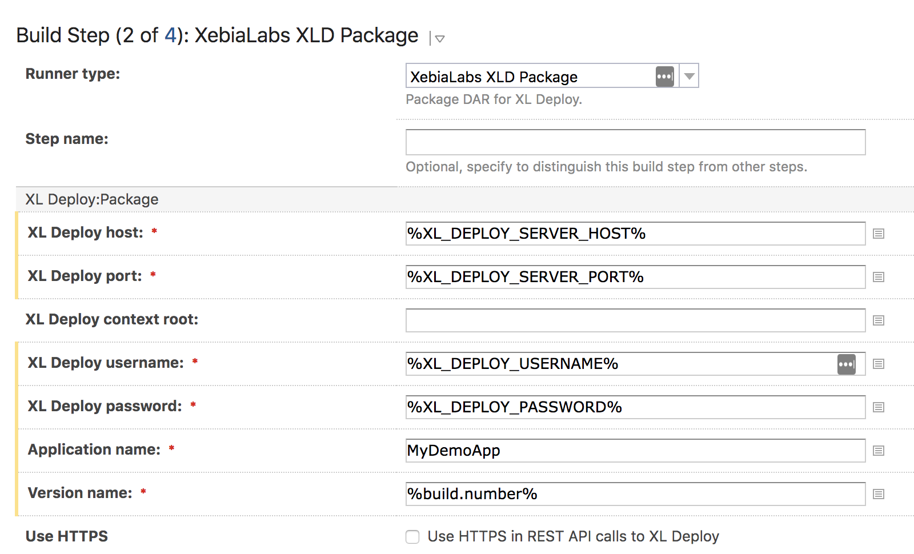
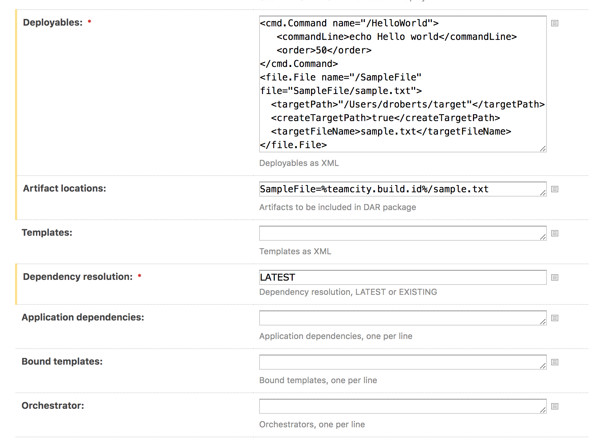
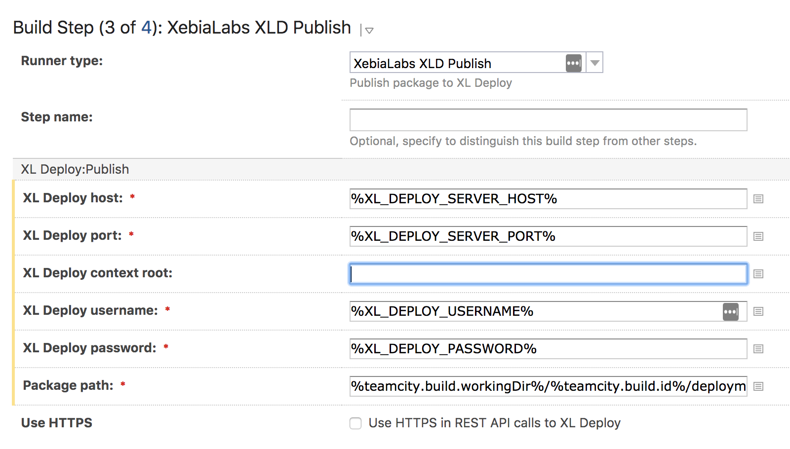
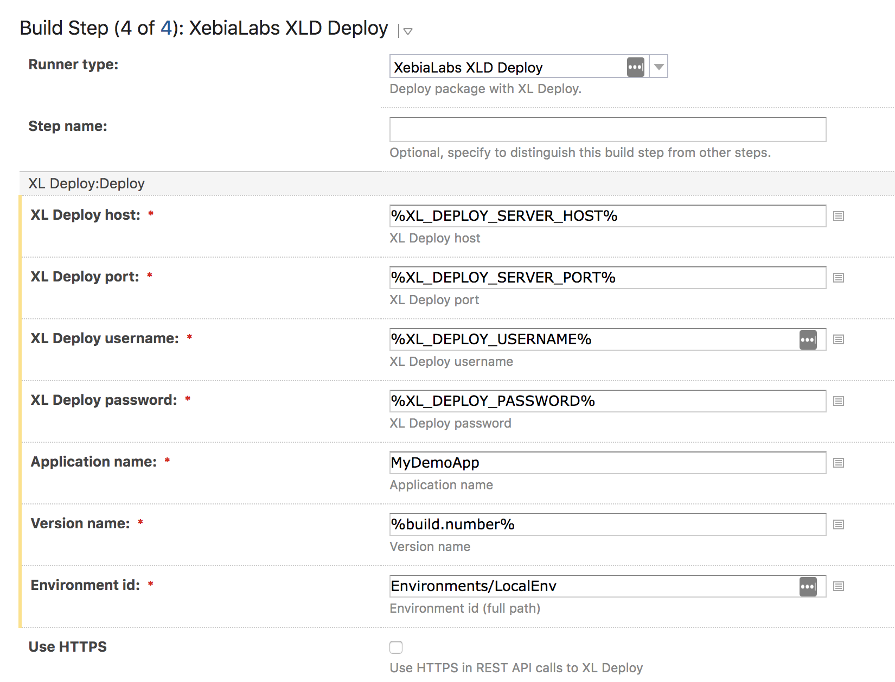

# TeamCity / XL Deploy plugin

[![Build Status][teamcity-xldeploy-plugin-travis-image] ][teamcity-xldeploy-plugin-travis-url]
[![Build Status][teamcity-xldeploy-plugin-codacy-image] ][teamcity-xldeploy-plugin-codacy-url]
[![Build Status][teamcity-xldeploy-plugin-code-climate-image] ][teamcity-xldeploy-plugin-code-climate-url]
[![License: MIT][teamcity-xldeploy-plugin-license-image] ][teamcity-xldeploy-plugin-license-url]
[![Github All Releases][teamcity-xldeploy-plugin-downloads-image] ]()

[teamcity-xldeploy-plugin-travis-image]: https://travis-ci.org/xebialabs-community/teamcity-xldeploy-plugin.svg?branch=master
[teamcity-xldeploy-plugin-travis-url]: https://travis-ci.org/xebialabs-community/teamcity-xldeploy-plugin
[teamcity-xldeploy-plugin-codacy-image]: https://api.codacy.com/project/badge/Grade/fbc097c70d8d483ea5f0a2aea69bd523
[teamcity-xldeploy-plugin-codacy-url]: https://www.codacy.com/app/joris-dewinne/teamcity-xldeploy-plugin
[teamcity-xldeploy-plugin-code-climate-image]: https://codeclimate.com/github/xebialabs-community/teamcity-xldeploy-plugin/badges/gpa.svg
[teamcity-xldeploy-plugin-code-climate-url]: https://codeclimate.com/github/xebialabs-community/teamcity-xldeploy-plugin
[teamcity-xldeploy-plugin-license-image]: https://img.shields.io/badge/License-MIT-yellow.svg
[teamcity-xldeploy-plugin-license-url]: https://opensource.org/licenses/MIT
[teamcity-xldeploy-plugin-downloads-image]: https://img.shields.io/github/downloads/xebialabs-community/teamcity-xldeploy-plugin/total.svg

#### Installation ####

1. Generate zip file using mvn package from root directory
2. Copy zip file to TeamCity Data Directory (e.g. ~/.BuildServer/plugins)
3. Restart TeamCity server
4. Configure build steps

#### Package step ####

* XL Deploy host, XL Deploy port, XL Deploy username, XL Deploy password are for future use.
* Deployable and Templates should be in XML format.
* All artifacts described in the Deployables XML with file="pathTo/filename" should be listed under Artifact locations.  The format is pathTo=PathInWorkspace, one per line.   Here, pathTo is the path relative to the DAR root and does not include the filename.  It is typically the same as the Artifact name.  PathInWorkspace is the path to the artifact in the TeamCity build workspace and includes the filename.
* Application dependencies should be listed in the format AppName=1.0 or AppName=[1.0,2.0), one per line.
* Bound templates shoudl be listed in the format /TemplateName, one per line.  The name should correspond to the name used in the XML under Templates.
* Orchestrators should be listed by name (e.g. parallel-by-container), one per line.
* The DAR package will be %teamcity.build.workingDir%/%teamcity.build.id%/deploymentPackage/ApplicationName-VersionName.dar.
 

#### Publish step ####

* If the DAR package is built in the XldPackage step, use %teamcity.build.workingDir%/%teamcity.build.id%/deploymentPackage/MyDemoApp-%build.number%.dar for its path.
 

#### Deploy step ####

* Specify Application Name, Version Name, and Enviroment Id.

#### Build parameters ####

Tested on TeamCity 2018.1.3.
