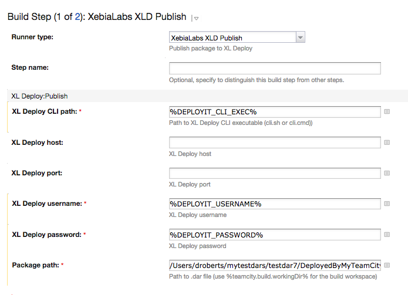
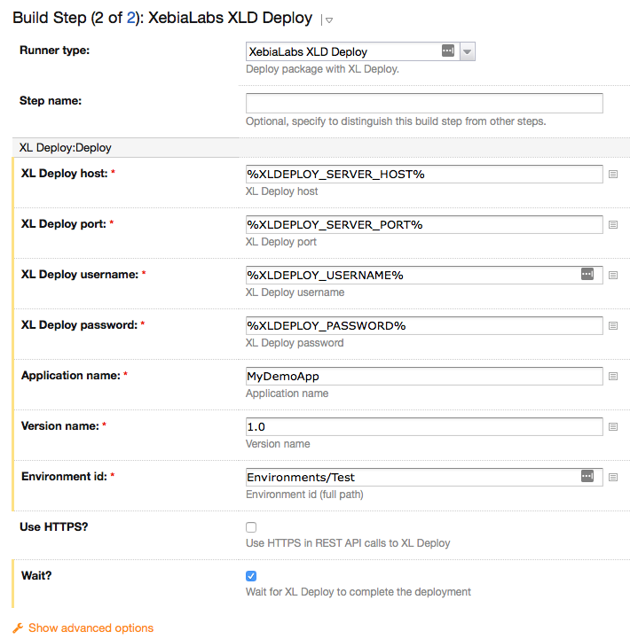
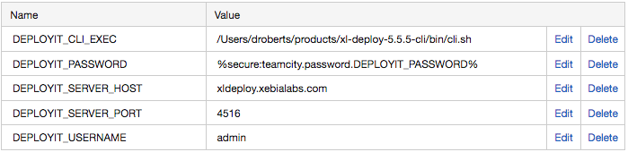

# teamcity-xldeploy-plugin

#### Installation ####

1. Generate zip file using mvn package from root directory
2. Copy zip file to TeamCity Data Directory (e.g. ~/.BuildServer/plugins)
3. Restart TeamCity server
4. Configure build steps

#### Publish step ####

#### Build step ####

#### Build parameters ####

Tested on TeamCity 10.0.3.
